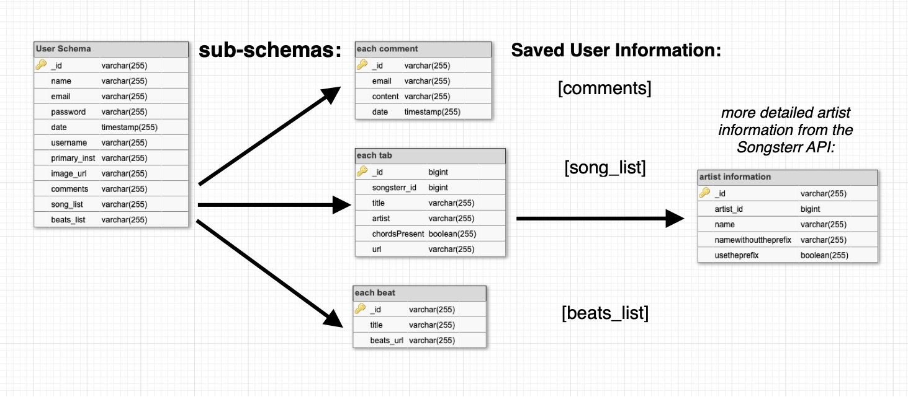

# Tab Sensei: Back End Models & Routes
​
### Local Installation
​
`npm i`
​
dependencies: axios, bcrypt, cors, dotenv, express, jsonwebtoken, mongoose, passport, passport-jwt
​
Your `.env` file should contain:
`JWT_SECRET:` any string
`MONGO_URI:` your MongoDB URI
`YOU_TUBE_API_KEY:` your YouTube API key
​
Register for a YouTube API key via [Google Developers](https://developers.google.com/youtube/v3/getting-started).
​
​
### Models
​
Tab Sensei uses MongoDB to store a user's profile information. In addition to their login information, this includes their primary instrument and the Cloudinary URL for their profile image, as well subschemas for comments they have made, beats from the site's beat bank, and tabs they have saved from search results.  
​
The comments subschema saves a tab's id along with the user's email and the comment text, allowing the site to easily display comments made by all users for any individual tab. Date information is also attached, allowing comments to display in chronological order:
​
```
const commentsSchema = new Schema({
  songsterr_id: Number,
  content: String,
  date: String,
  email: String,
})
```
​
Title and artist information for tabs are retrieved from the Songsterr.com API.
```
const songListSchema = new Schema({
  songsterr_id: Number,
  title: String,
  artist: [artistSchema],
  chordsPresent: Boolean,
  url: String
})
```
Artist information is a subschema of the song list:
```
const artistSchema = new Schema({
  artist_id: Number,
  name: String,
  nameWithoutThePrefix: String,
  useThePrefix: Boolean
})
```
Video tutorial results come from the YouTube API, and are not stored in the database.
​
### Routes: Mongoose Commands
​
GET requests for a user's song list and profile image simply return a user's entire record as JSON. This is then parsed on the front end:
```
db.User.find({ email: req.params.id })
```
​
GET requests for comments return all users that have the tab's id in their comments array. The content of these comments is then parsed on the front end:
```
db.User.find({ "comments.songsterr_id" : req.params.tabid })
```
​
POST: Add tab information to a user's song list array using `$push`.
```
db.User.update(
  { email: req.body.email },
  { $push:
    { "song_list":
      { "songsterr_id": req.body.tab_id, "title": req.body.title, "artist": [{"name": req.body.artist}]}}
    }
  )
```
​
POST: Add comment information to a user's comments array using `$push`:
```
db.User.update(
  { email: email },
  { $push:
    { "comments":
      { "songsterr_id": currentSong, "content": content, "date": date, "email": email }
    }
  }
)
```
​
PUT: Remove a comment record from the array using `$pull`:
```
db.User.update(
  { email: req.body.email }, { $pull: { "comments": { "_id": mongoId } }}
)
```
​
PUT: Remove a tab from the user's song list using `$pull`:
```
db.User.update(
  { email: req.body.email }, { $pull: { "song_list": { "_id": mongoId } }}
)
```
### Database Summary:
​


code review